<table>

  <tr>
    <th colspan="6" align="center"><h2>Telecom Project</h2></th>
  </tr>

  <tr>
    <td width="16.6%" align="center">
      <a href="project-telecom/render/00-day-zero.png" target="_blank">
        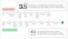
      </a>
    </td>
     <td width="16.6%" align="center">
      <a href="project-telecom/render/01-constraints.png" target="_blank">
        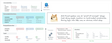
      </a>
    </td>
    <td width="16.6%" align="center">
      <a href="project-telecom/render/02-manual.png" target="_blank">
        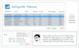
      </a>
    </td>
    <td width="16.6%" align="center">
      <a href="project-telecom/render/03-vip.png" target="_blank">
        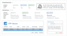
      </a>
    </td>
    <td width="16.6%" align="center">
      <a href="project-telecom/render/04-sms.png" target="_blank">
        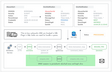
      </a>
    </td>
     <td width="16.6%" align="center">
      <a href="project-telecom/render/05-azure-port.png" target="_blank">
        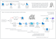
      </a>
    </td>
  </tr>

  <tr>
    <td align="center">Day Zero</td>
    <td align="center">Constraints</td>
    <td align="center">Manual</td>
    <td align="center">VIP</td>
    <td align="center">SMS</td>
    <td align="center">Azure Port</td>
  </tr>
</table>

<table>

  <tr>
    <th colspan="6" align="center"><h2>Logistics Project</h2></th>
  </tr>

  <tr>
    <td width="16.6%" align="center">
      <a href="project-logistics/render/00-ko-mapping-ef-wipe.png" target="_blank">
        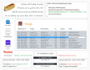
      </a>
    </td>
     <td width="16.6%" align="center">
      <a href="project-logistics/render/01-new-fields.png" target="_blank">
        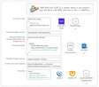
      </a>
    </td>
    <td width="16.6%" align="center">
      <a href="project-logistics/render/02-route-snapshots.png" target="_blank">
        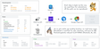
      </a>
    </td>
    <td width="16.6%" align="center">
      <a href="project-logistics/render/03-currency.png" target="_blank">
        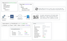
      </a>
    </td>
    <td width="16.6%" align="center">
      <a href="project-logistics/render/04-ko-ef-performance.png" target="_blank">
        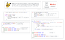
      </a>
    </td>
     <td width="16.6%" align="center">
      <a href="project-logistics/render/05-dry.png" target="_blank">
        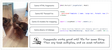
      </a>
    </td>
  </tr>

  <tr>
    <td align="center">KO & EF wipe</td>
    <td align="center">New Fields</td>
    <td align="center">Route Snapshots</td>
    <td align="center">Currency</td>
    <td align="center">KO & EF performance</td>
    <td align="center">DRY</td>
  </tr>
</table>

<table>

  <tr>
    <th colspan="6" align="center"><h2>Healthcare Project</h2></th>
  </tr>

  <tr>
    <td width="16.6%" align="center">
      <a href="project-healthcare/render/00-crystal-reports.png" target="_blank">
        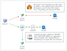
      </a>
    </td>
     <td width="16.6%" align="center">
      <a href="project-healthcare/render/01-loa-export.png" target="_blank">
        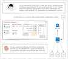
      </a>
    </td>
    <td width="16.6%" align="center">
      <a href="project-healthcare/render/02-fee-schedules.png" target="_blank">
        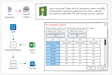
      </a>
    </td>
    <td width="16.6%" align="center">
      <a href="project-healthcare/render/03-granular-permissions.png" target="_blank">
        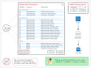
      </a>
    </td>
    <td width="16.6%" align="center">
      <a href="project-healthcare/render/04-installments.png" target="_blank">
        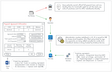
      </a>
    </td>
     <td width="16.6%" align="center">
      <a href="project-healthcare/render/05-cpp-bug.png" target="_blank">
        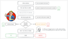
      </a>
    </td>
  </tr>

  <tr>
    <td align="center">Crystal Reports</td>
    <td align="center">LOA Export</td>
    <td align="center">Fee Schedules</td>
    <td align="center">Permissions</td>
    <td align="center">Installments</td>
    <td align="center">Pointer Bug</td>
  </tr>
</table>

